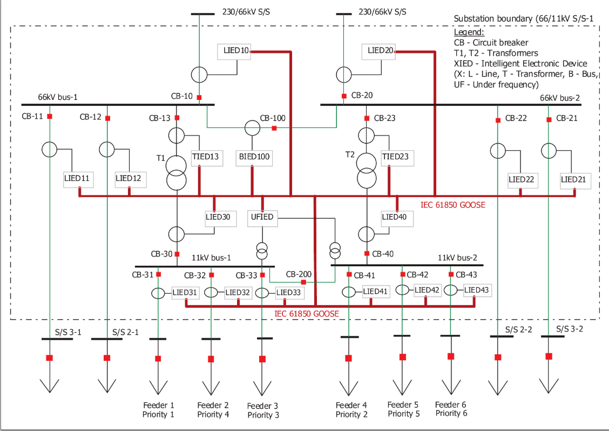

# IEC61850SecurityDataset
This repository contains network traces that describe GOOSE communications in a substation. The reference one-line diagram used for generating the network traces is shown in Figure 1. It consists of 4-buses and 18 LEDs. Line feeders (1-6) are connected to different loads while the remaining feeders connect the substation to other nearby substations to provide redundancy. The IEDs communicate with  each other using the GOOSE protocol defined in the IEC 61850 standard. Based on the one-line diagram, we generate multiple GOOSE network traces to represent normal, disturbance and attack scenarios.

Figure 1: Substation one-line diagram

## Normal Scenario
There are 18 IEDs in substation including Line Feeder IEDs, Transformer Feeder IEDs, Bus IED and Under Frequency Load Shedding IEDs.
These IEDs send multicast packets every second to share and update their status. For each transmission of a GOOSE frame under a normal scenario, the stNum and timestamp values remain the same, but the sqNum is incremented. This behavior is captured in the Normal.pcapng stored under the following directory: Normal/No_Variable_Loading.

## Disturbance Scenario

We consider three disturbance scenarios under which substation protection system operates and created three representative network traces namely, BusbarProtection.pcapng, BreakFailure.pcapng, and UnderFrequency.pcapng.

**Busbar protection**

1. Let us consider that a fault occurs at busbar 66kV bus-1. The incomer line LIED10 will pick up on overcurrent, the other IEDs wont.
2. The incomer line LIED10 will know through GOOSE communication that the overcurrent elements of other IEDs have not picked up.
3. The incomer line LIED10 will quickly realise of busbar fault and trigger a trip to its own breaker CB-10 first and subsequently to the breakers associated with the busbars i.e., CB-11, CB-12 and CB-13.
4. The trip status of CB-10 is sent by LIED10 through GOOSE communication to LIED11, LIED12 and TIED13 to trigger trip for their respective breakers.

**Breaker failure protection**

1. Assume that a fault occurs in the feeder connecting substation S/S 3-1. The associated LIED11 overcurrent (O/C) element picks up, however, the breaker CB-11 does not trip due to mechanical failure.
2. The GOOSE communication of breaker failure and O/C element pick-up is sent from LIED11 to the LIED10(incomer), LIED12 and TIED13.
3. The communication triggers tripping of circuit breakers CB-10, CB-12 and CB-13. Subsequently, the remote CB (in S/S 3-1) is tripped using proper communication media

**Underfrequencey load-shedding**
1. Under frequency IED (UFIED) can sense the under frequency in both 11kV buses when voltage transformer (VT) inputs are directly given to this IED.
2. Alternately, incomer line IEDs (LIED30 and LIED40) can relay the information to the under frequency IED over GOOSE (when there is no direct VT input to UFIED).
3. UFIED triggers a trip over GOOSE to the least priority (Priority 6) consumer first via LIED43. Then, CB-43 is tripped at first stage.
4. After a time delay (usually 2-4 seconds) if the frequency is not stabilized at the desired value, further loads are shed. The sequence of tripping goes as: Priority 6 (CB43) →Priority 5 (CB-42)→Priority 4 (CB-32) . . .
5. Between each two stages of tripping there is a time delay of 2-4 seconds. The trip is initiated via GOOSE communication to respective IEDs such as LIED43, LIED42, LIED32, etc.

## Attack Scenarios
Table 1 lists the different types of GOOSE attacks and the tactics for implementing them. In short, a denial of service (DoS) attack is a malicious attempt by an attacker to block a legitimate IED from accessing a particular resource through flooding. A message suppression (MS) attack refers to the hijacking of the communication channel by modifying the GOOSE header fields to prevent legitimate IEDs from receiving critical messages or updates. Data Manipulation (DM) refers to the process of injecting modified network payloads into the network to mask unauthorized changes. The different GOOSE-related attacks are organized into three subfolders under the Attack directory. Each subfolder contains attack trace(s) generated using the Normal.pcapng as a baseline. The duration of each PCAP file is 10 minutes. Description of each file is explained below.

|Attacks|Tactics|
|DoS.1| - Flood bogus frames|
|MS.1| - Inject GOOSE sequence number (sqNum)|
|MS.2| - Inject GOOSE status number (stNum)|
|DM.1| - Modify current measurements reported by the merging units|
|DM.2| - Inject modified Boolean value of circuit breaker|
|DM.3| - Replay a previously valid message|

- Data Manipulation (DM)

**Name: AS1.pcapng**

**Attack scenario 1:** Inject false current measurements to bias the power system state estimation process without being detected.

	- LIED10 injects a GOOSE frame (No. 588) containing a value of 380 to the current magnitude of phase A at time= 11.9 sec.

	- LIED10 injects a GOOSE frame (No. 1175) containing a value of 270 to the current magnitude of phase B at time= 22.5 sec.

	- LIED10 injects a GOOSE frame (No. 1771) containing a value of 360 to the current magnitude of phase C at time= 33.1 sec.

**Name: AS2.pcapng**

**Attack scenario 2:** Inject a malicious GOOSE frame to control the state of the circuit breaker

	- LIED11 injects a malicious GOOSE frame (No. 597) by toggling the status of the circuit breaker from FALSE to TRUE ('tripped') at time= 12.3 sec

**Attack scenario 3:** Replay an old payload containing circuit breaker 'trip' status at a later time

**Name: AS3.pcapng**
	- [place text here]

- Denial of Service (DoS)

**Name: AS1.pcapng**

**Attack scenario 1:** Flood GOOSE messages to congest the substation network

	- LIED10 injects 5000 GOOSE frames between time= 12.5 sec and time= 22.1 sec

	- LIED12 injects 5000 GOOSE frames between time= 54.7 sec and time= 68.3 sec

- Message Suppression (MS)

**Name: AS1.pcapng**

**Attack scenario 1:** Inject a high stNum value or slightly higher than the previously recorded stNum, where sqNum≠0.

	- LIED10 injects a GOOSE frame (No. 542) with stNum=9999 and sqNum=10 at time= 13.9 sec.

	- LIED12 injects a GOOSE frame (No. 784) with stNum=5 and sqNum=15 at time= 18.9 sec.

**Name: AS2.pcapng**

**Attack scenario 2:** Replay a previously valid GOOSE frame containing high stNum, sqNum =0 but stale timestamp

	- LIED10 replays a GOOSE frame (No. 534) with stNum=9999 and sqNum=0 at time= 10.4 sec.

	- LIED12 replays a GOOSE frame (No. 774) with stNum=5 and sqNum=0 at time= 15.5 sec.

**Name: AS3.pcapng**

**Attack scenario 3:** Inject a high stNum frame with sqNum = 0 and a valid timestamp.

	- LIED10 injects a GOOSE frame (No. 534) with stNum=9999 and sqNum=0 at time= 10.4 sec, where the timestamp of the injected GOOSE frame > previously received GOOSE frames.

	- LIED12 injects a GOOSE frame (No. 774) with stNum=5 and sqNum=0 at time=15.5 sec, where the timestamp of the injected GOOSE frame > previously received GOOSE frames.

**Name: AS4.pcapng**

**Attack scenario 4:** Inject a high sqNum frame to cause GOOSE frames to arrive at the receiver out-of-sequence i.e., not matching the order of transmission at the sender.

	- LIED10 injects a GOOSE frame (No. 556) with sqNum=9999 at time= 12.7 sec

**Name: CompositeAttack.pcapng**

**Attack scenario:** Inject high stNum attack followed by modifying the circuit breaker status associated with CB-11.

	- LIED11 injects a GOOSE frame (No. 542) with stNum=9999 and sqNum=0 at time=11.3 sec

	- LIED11 modifies the Boolean value of CB-11 from ‘1’ to ‘0’ and injects the modified GOOSE frame (No. 792) at time=16.3 sec.

## Others

**Scenario folder:**  each folder represents one scenario, it contains

1. One pcap file: captures GOOSE packets from 18 IEDs during 10 mins. 	
2. 18 csv files: list transmitted data from 18 IEDs at every second during 10 mins. But the attacking scenario is based on normal scenario's trasmission traffic, so CSVs in Attack folder are the same with Normal's.

**SCL folder:**

It contains 18 IID files to define configuration of 18 IEDs. It also discribes data exchange format from IEDs. From those file, you can understand the structure of payload in pcap files.

**Note:** This repository will be updated as new trace file becomes available.
